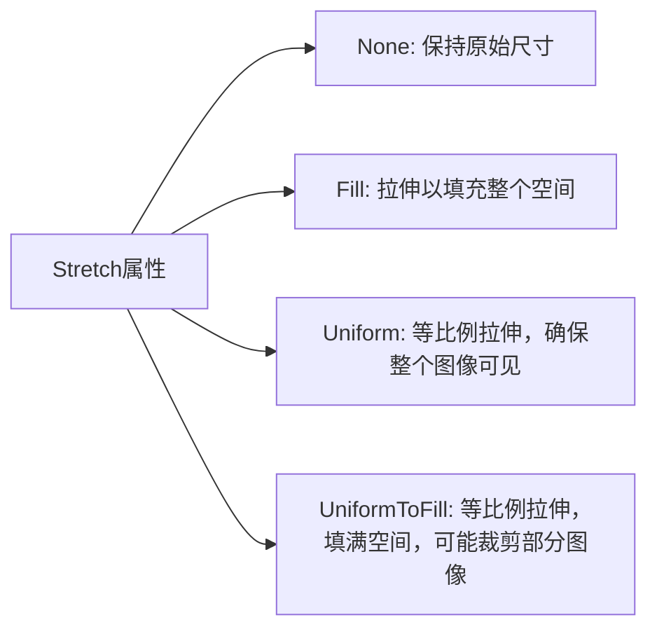

# WPF之Image控件详解

## 1. 概述

Image控件是WPF(Windows Presentation Foundation)中用于显示图像的基本控件。它支持多种图像格式，包括BMP、JPG、PNG、GIF、TIFF等，还支持矢量图形格式SVG（通过额外的库）。作为WPF视觉系统的一部分，Image控件提供了丰富的图像处理功能，如拉伸、裁剪、旋转和转换等。

本文将详细介绍Image控件的属性、用法、性能优化技巧以及常见问题的解决方案，帮助开发者更好地在WPF应用中处理图像。

## 2. Image控件的基本属性

Image控件继承自FrameworkElement，具有以下重要属性：

| 属性名 | 类型 | 说明 |
|-------|------|------|
| Source | ImageSource | 指定图像的源，可以是BitmapSource、DrawingImage等 |
| Stretch | Stretch | 控制图像如何拉伸以填充分配的空间 |
| StretchDirection | StretchDirection | 定义图像拉伸的方向 |
| NineGrid | Thickness | 定义一个矩形区域，用于控制图像拉伸的方式 |

### 2.1 Source属性

Source属性是Image控件最基本的属性，用于指定要显示的图像源。它的类型是ImageSource，这是一个抽象基类，实际使用时通常使用它的子类：

- **BitmapSource**: 位图图像的基类
  - **BitmapImage**: 最常用的图像源，支持加载各种图像格式
  - **RenderTargetBitmap**: 从视觉对象渲染位图
  - **WriteableBitmap**: 可以被修改像素的位图
- **DrawingImage**: 矢量图形的图像源

### 2.2 Stretch属性

Stretch属性决定了图像如何适应其容器空间。它有以下几个可选值：



### 2.3 StretchDirection属性

StretchDirection属性控制图像的拉伸方向，可选值有：

- **Both**: 图像可以被放大或缩小
- **UpOnly**: 图像只能被放大
- **DownOnly**: 图像只能被缩小

## 3. 在XAML中使用Image控件

### 3.1 基本用法

最简单的Image控件使用方式如下：

```xml
<Image Source="Images/logo.png" Width="200" Height="100"/>
```

### 3.2 设置拉伸模式

```xml
<Image Source="Images/background.jpg" 
       Stretch="Uniform" 
       StretchDirection="DownOnly"/>
```

### 3.3 设置图像对齐方式

```xml
<Image Source="Images/icon.png" 
       Width="300" 
       Height="200" 
       HorizontalAlignment="Center" 
       VerticalAlignment="Center"/>
```

## 4. 在代码中操作Image控件

### 4.1 加载本地图像

```csharp
// 从本地文件加载图像
BitmapImage bitmap = new BitmapImage();
bitmap.BeginInit();
bitmap.UriSource = new Uri("pack://application:,,,/Images/photo.jpg", UriKind.Absolute);
// CacheOption用于控制图像数据的缓存行为
bitmap.CacheOption = BitmapCacheOption.OnLoad;
bitmap.EndInit();

// 将图像分配给Image控件
myImage.Source = bitmap;
```

### 4.2 异步加载图像

```csharp
public async Task LoadImageAsync(string imagePath)
{
    // 使用Task.Run将IO操作移至后台线程
    await Task.Run(() =>
    {
        BitmapImage bitmap = new BitmapImage();
        bitmap.BeginInit();
        bitmap.UriSource = new Uri(imagePath);
        bitmap.CacheOption = BitmapCacheOption.OnLoad; // 加载完成后关闭流
        bitmap.EndInit();
        bitmap.Freeze(); // 使图像可以跨线程访问
        
        // 切换回UI线程设置图像
        Dispatcher.Invoke(() =>
        {
            myImage.Source = bitmap;
        });
    });
}
```

### 4.3 从流中加载图像

```csharp
// 从流中加载图像（例如从数据库或网络）
public void LoadImageFromStream(Stream imageStream)
{
    BitmapImage bitmap = new BitmapImage();
    bitmap.BeginInit();
    bitmap.StreamSource = imageStream;
    bitmap.CacheOption = BitmapCacheOption.OnLoad; // 图像加载后关闭流
    bitmap.EndInit();
    
    myImage.Source = bitmap;
}
```

### 4.4 控制图像的解码尺寸

```csharp
// 控制解码尺寸可以大大提高内存效率，特别是对于大图像
BitmapImage bitmap = new BitmapImage();
bitmap.BeginInit();
bitmap.UriSource = new Uri(imagePath);
bitmap.DecodePixelWidth = 300; // 只设置宽度，高度按比例缩放
// 或者同时设置宽度和高度
// bitmap.DecodePixelHeight = 200;
bitmap.EndInit();

myImage.Source = bitmap;
```

## 5. 图像源类型详解

### 5.1 BitmapImage类

BitmapImage是最常用的图像源类型，它支持从文件、Uri或流中加载图像。

```csharp
// 从Uri创建BitmapImage的简便方法
BitmapImage bitmap = new BitmapImage(new Uri("pack://application:,,,/Images/photo.jpg"));

// 使用BeginInit()/EndInit()方法可以设置更多选项
BitmapImage bitmap = new BitmapImage();
bitmap.BeginInit();
bitmap.UriSource = new Uri("pack://application:,,,/Images/photo.jpg");
bitmap.CreateOptions = BitmapCreateOptions.PreservePixelFormat;
bitmap.CacheOption = BitmapCacheOption.OnLoad;
bitmap.EndInit();
```

### 5.2 WriteableBitmap类

WriteableBitmap允许直接修改位图的像素数据。

```csharp
// 创建一个可写位图
WriteableBitmap writeableBitmap = new WriteableBitmap(
    100, // 宽度
    100, // 高度
    96, // DPI X
    96, // DPI Y
    PixelFormats.Bgr32, // 像素格式
    null // 调色板
);

// 修改像素数据
writeableBitmap.Lock();
try
{
    // 获取后备缓冲区
    IntPtr backBuffer = writeableBitmap.BackBuffer;
    int stride = writeableBitmap.BackBufferStride;
    
    // 例如，将所有像素设置为红色
    unsafe
    {
        for (int y = 0; y < writeableBitmap.Height; y++)
        {
            for (int x = 0; x < writeableBitmap.Width; x++)
            {
                int offset = y * stride + x * 4;
                *(byte*)(backBuffer + offset) = 0;     // B
                *(byte*)(backBuffer + offset + 1) = 0; // G
                *(byte*)(backBuffer + offset + 2) = 255; // R
                *(byte*)(backBuffer + offset + 3) = 255; // A
            }
        }
    }
    
    // 通知位图已修改
    writeableBitmap.AddDirtyRect(new Int32Rect(0, 0, (int)writeableBitmap.Width, (int)writeableBitmap.Height));
}
finally
{
    writeableBitmap.Unlock();
}

myImage.Source = writeableBitmap;
```

### 5.3 DrawingImage类

DrawingImage用于将矢量图形显示在Image控件中。

```csharp
// 创建一个DrawingImage
DrawingImage drawingImage = new DrawingImage();

// 创建一个DrawingGroup
DrawingGroup drawingGroup = new DrawingGroup();

// 添加几何图形
using (DrawingContext drawingContext = drawingGroup.Open())
{
    // 绘制一个矩形
    drawingContext.DrawRectangle(
        Brushes.LightBlue, // 填充画刷
        new Pen(Brushes.Blue, 2), // 线条画刷
        new Rect(10, 10, 80, 60) // 矩形大小
    );
    
    // 绘制一个椭圆
    drawingContext.DrawEllipse(
        Brushes.LightGreen,
        new Pen(Brushes.Green, 2),
        new Point(50, 40), // 中心点
        30, // X半径
        20  // Y半径
    );
}

// 设置DrawingImage的Drawing属性
drawingImage.Drawing = drawingGroup;

// 设置Image控件的Source
myImage.Source = drawingImage;
```

## 6. 处理SVG图像

WPF原生不支持SVG格式，但可以通过第三方库来实现。以下是使用SharpVectors库的示例：

```csharp
// 需要先安装SharpVectors NuGet包
// Install-Package DotNetProjects.SVGImage

// XAML中的使用方式
// <svgc:SVGImage Source="/Resources/icon.svg"/>

// 在代码中使用
SVGImage svgImage = new SVGImage();
svgImage.Source = new Uri("pack://application:,,,/Resources/icon.svg");
```

## 7. 性能优化技巧

### 7.1 使用DecodePixelWidth/DecodePixelHeight

当只需要显示较小尺寸的图像时，应该使用DecodePixelWidth或DecodePixelHeight属性来减少内存使用。

```csharp
BitmapImage bitmap = new BitmapImage();
bitmap.BeginInit();
bitmap.UriSource = new Uri(imagePath);
// 只加载需要的大小，而不是原始大小
bitmap.DecodePixelWidth = 300;
bitmap.EndInit();
```

### 7.2 冻结图像以便跨线程使用

使用Freeze()方法可以使图像变为不可变对象，从而可以在多个线程间共享，避免了线程同步问题。

```csharp
BitmapImage bitmap = new BitmapImage(new Uri(imagePath));
bitmap.Freeze(); // 冻结图像，使其可以跨线程访问

// 现在可以在任何线程上使用此bitmap
```

### 7.3 使用BitmapCacheOption.OnLoad关闭文件流

使用CacheOption设置为OnLoad可以在图像加载完成后立即关闭文件流，避免文件锁定问题。

```csharp
BitmapImage bitmap = new BitmapImage();
bitmap.BeginInit();
bitmap.UriSource = new Uri(imagePath);
bitmap.CacheOption = BitmapCacheOption.OnLoad; // 加载后关闭流
bitmap.EndInit();
```

### 7.4 实现图像缓存

对于需要重复显示的图像，可以实现简单的缓存机制：

```csharp
// 简单的图像缓存类
public class ImageCache
{
    private static Dictionary<string, BitmapImage> _cache = new Dictionary<string, BitmapImage>();
    
    public static BitmapImage GetImage(string path)
    {
        if (_cache.ContainsKey(path))
            return _cache[path];
            
        BitmapImage bitmap = new BitmapImage();
        bitmap.BeginInit();
        bitmap.UriSource = new Uri(path);
        bitmap.CacheOption = BitmapCacheOption.OnLoad;
        bitmap.EndInit();
        bitmap.Freeze(); // 使图像可以跨线程访问
        
        _cache[path] = bitmap;
        return bitmap;
    }
    
    public static void ClearCache()
    {
        _cache.Clear();
    }
}
```

### 7.5 使用虚拟化容器

当在列表控件中显示大量图像时，应该启用UI虚拟化，只加载当前可见的项目：

```xml
<ListBox ItemsSource="{Binding Images}">
    <ListBox.ItemsPanel>
        <ItemsPanelTemplate>
            <VirtualizingStackPanel VirtualizingPanel.IsVirtualizing="True"
                                   VirtualizingPanel.VirtualizationMode="Recycling"/>
        </ItemsPanelTemplate>
    </ListBox.ItemsPanel>
    <ListBox.ItemTemplate>
        <DataTemplate>
            <Image Source="{Binding ImageSource}" Width="100" Height="100"/>
        </DataTemplate>
    </ListBox.ItemTemplate>
</ListBox>
```

## 8. 常见问题与解决方案

### 8.1 内存泄漏问题

在WPF应用中使用大量图像时，常常会遇到内存泄漏问题。以下是避免内存泄漏的关键点：

```csharp
// 问题: 加载大量图像导致内存持续增长
// 解决方案1: 确保在窗口关闭时清除图像源
protected override void OnClosing(CancelEventArgs e)
{
    base.OnClosing(e);
    
    // 清除图像源
    myImage.Source = null;
    
    // 如果使用了列表控件
    imageListBox.ItemsSource = null;
    imageListBox.Items.Clear();
    
    // 手动触发垃圾收集（在实际应用中应谨慎使用）
    GC.Collect();
}
```

### 8.2 UI线程阻塞问题

```csharp
// 问题: 加载大图像会阻塞UI线程
// 解决方案: 使用异步方法加载图像
public async void LoadImageAsync()
{
    Progress.Visibility = Visibility.Visible; // 显示加载指示器
    
    try
    {
        BitmapImage bitmap = await Task.Run(() => 
        {
            BitmapImage bmp = new BitmapImage();
            bmp.BeginInit();
            bmp.UriSource = new Uri(imagePath);
            bmp.CacheOption = BitmapCacheOption.OnLoad;
            bmp.EndInit();
            bmp.Freeze(); // 重要: 使位图可以跨线程访问
            return bmp;
        });
        
        myImage.Source = bitmap;
    }
    catch (Exception ex)
    {
        MessageBox.Show("加载图像失败: " + ex.Message);
    }
    finally
    {
        Progress.Visibility = Visibility.Collapsed; // 隐藏加载指示器
    }
}
```

### 8.3 图像质量问题

```csharp
// 问题: 图像显示质量不佳
// 解决方案: 设置RenderOptions附加属性
<Image Source="Images/photo.jpg"
       RenderOptions.BitmapScalingMode="HighQuality"/>
```

## 9. 高级使用场景

### 9.1 图像转换与滤镜

WPF提供了多种图像效果，可以应用于Image控件：

```xml
<Image Source="Images/photo.jpg">
    <Image.Effect>
        <BlurEffect Radius="10"/>
    </Image.Effect>
</Image>
```

在代码中应用效果：

```csharp
// 应用模糊效果
BlurEffect blurEffect = new BlurEffect();
blurEffect.Radius = 10;
myImage.Effect = blurEffect;

// 应用灰度效果
myImage.Effect = new FormsControls.Effects.GrayscaleEffect();
```

### 9.2 实现图像裁剪

```csharp
// 使用Clip属性裁剪图像
RectangleGeometry clipGeometry = new RectangleGeometry();
clipGeometry.Rect = new Rect(50, 50, 200, 150); // 从图像的(50,50)位置裁剪200x150的区域
myImage.Clip = clipGeometry;
```

### 9.3 图像旋转与变换

```xml
<Image Source="Images/photo.jpg">
    <Image.RenderTransform>
        <TransformGroup>
            <RotateTransform Angle="45"/>
            <ScaleTransform ScaleX="0.8" ScaleY="0.8"/>
        </TransformGroup>
    </Image.RenderTransform>
</Image>
```

### 9.4 响应式图像容器

创建一个能够保持图像比例且响应窗口大小变化的容器：

```xml
<Viewbox Stretch="Uniform">
    <Image Source="Images/photo.jpg"/>
</Viewbox>
```

## 10. 实用示例

### 10.1 图像浏览器

下面是一个简单的图像浏览器示例，支持基本的图像浏览功能：

```csharp
public class ImageBrowser : Window
{
    private Image _imageControl;
    private List<string> _imagePaths;
    private int _currentIndex = 0;
    
    public ImageBrowser(List<string> imagePaths)
    {
        _imagePaths = imagePaths;
        
        // 初始化界面
        Title = "图像浏览器";
        Width = 800;
        Height = 600;
        
        // 创建主布局
        Grid grid = new Grid();
        
        // 添加按钮和图像控件
        StackPanel buttonPanel = new StackPanel();
        buttonPanel.Orientation = Orientation.Horizontal;
        buttonPanel.HorizontalAlignment = HorizontalAlignment.Center;
        
        Button prevButton = new Button { Content = "上一张", Margin = new Thickness(5) };
        Button nextButton = new Button { Content = "下一张", Margin = new Thickness(5) };
        
        prevButton.Click += (s, e) => ShowPreviousImage();
        nextButton.Click += (s, e) => ShowNextImage();
        
        buttonPanel.Children.Add(prevButton);
        buttonPanel.Children.Add(nextButton);
        
        // 创建可滚动的图像容器
        ScrollViewer scrollViewer = new ScrollViewer();
        scrollViewer.HorizontalScrollBarVisibility = ScrollBarVisibility.Auto;
        scrollViewer.VerticalScrollBarVisibility = ScrollBarVisibility.Auto;
        
        _imageControl = new Image();
        _imageControl.Stretch = Stretch.None; // 使用原始大小
        
        scrollViewer.Content = _imageControl;
        
        // 设置布局
        grid.RowDefinitions.Add(new RowDefinition { Height = new GridLength(1, GridUnitType.Star) });
        grid.RowDefinitions.Add(new RowDefinition { Height = GridLength.Auto });
        
        Grid.SetRow(scrollViewer, 0);
        Grid.SetRow(buttonPanel, 1);
        
        grid.Children.Add(scrollViewer);
        grid.Children.Add(buttonPanel);
        
        Content = grid;
        
        // 加载第一张图像
        LoadCurrentImage();
    }
    
    private void ShowPreviousImage()
    {
        if (_currentIndex > 0)
        {
            _currentIndex--;
            LoadCurrentImage();
        }
    }
    
    private void ShowNextImage()
    {
        if (_currentIndex < _imagePaths.Count - 1)
        {
            _currentIndex++;
            LoadCurrentImage();
        }
    }
    
    private async void LoadCurrentImage()
    {
        try
        {
            Title = $"图像浏览器 - {System.IO.Path.GetFileName(_imagePaths[_currentIndex])} ({_currentIndex + 1}/{_imagePaths.Count})";
            
            BitmapImage bitmap = await Task.Run(() =>
            {
                BitmapImage bmp = new BitmapImage();
                bmp.BeginInit();
                bmp.UriSource = new Uri(_imagePaths[_currentIndex]);
                bmp.CacheOption = BitmapCacheOption.OnLoad;
                bmp.EndInit();
                bmp.Freeze();
                return bmp;
            });
            
            _imageControl.Source = bitmap;
        }
        catch (Exception ex)
        {
            MessageBox.Show($"加载图像失败: {ex.Message}");
        }
    }
}
```

### 10.2 图像缩略图生成器

```csharp
/// <summary>
/// 生成图像的缩略图
/// </summary>
/// <param name="originalImagePath">原始图像路径</param>
/// <param name="thumbnailSize">缩略图尺寸</param>
/// <returns>缩略图的BitmapSource</returns>
public static BitmapSource GenerateThumbnail(string originalImagePath, int thumbnailSize)
{
    BitmapImage originalImage = new BitmapImage();
    originalImage.BeginInit();
    originalImage.UriSource = new Uri(originalImagePath);
    originalImage.DecodePixelWidth = thumbnailSize; // 只需设置宽度，高度会按比例缩放
    originalImage.CacheOption = BitmapCacheOption.OnLoad;
    originalImage.EndInit();
    
    // 如果需要将缩略图保存为文件
    // SaveThumbnailToFile(originalImage, "thumbnail.jpg");
    
    return originalImage;
}

/// <summary>
/// 将缩略图保存为文件
/// </summary>
/// <param name="image">图像源</param>
/// <param name="filePath">保存路径</param>
public static void SaveThumbnailToFile(BitmapSource image, string filePath)
{
    using (FileStream stream = new FileStream(filePath, FileMode.Create))
    {
        JpegBitmapEncoder encoder = new JpegBitmapEncoder();
        encoder.QualityLevel = 80; // 控制JPEG质量级别
        encoder.Frames.Add(BitmapFrame.Create(image));
        encoder.Save(stream);
    }
}
```

## 11. 总结

本文详细介绍了WPF中Image控件的使用方法、属性、性能优化技巧以及常见问题的解决方案。通过正确使用Image控件，开发者可以在WPF应用中高效地处理和显示图像，同时避免内存泄漏和性能问题。

关键要点包括：

1. 使用适当的图像源类型（BitmapImage, DrawingImage等）
2. 利用DecodePixelWidth/Height属性优化内存使用
3. 通过异步加载避免UI线程阻塞
4. 使用Freeze()方法使图像可以跨线程访问
5. 合理设置BitmapCacheOption避免文件锁定问题
6. 实现图像缓存机制提高性能
7. 在列表控件中启用虚拟化以处理大量图像

## 12. 相关资源

- [WPF官方文档 - Image类](https://learn.microsoft.com/zh-cn/dotnet/api/system.windows.controls.image)
- [SharpVectors - WPF的SVG支持库](https://github.com/dotnetprojects/SVGImage)
- [WPF图像处理性能优化](https://weblog.west-wind.com/posts/2024/Jan/03/Working-around-the-WPF-ImageSource-Blues)
- [WPF Image控件性能优化技巧](https://stackoverflow.com/questions/9442297/why-is-image-source-so-slow-and-what-can-i-do-about-it) 